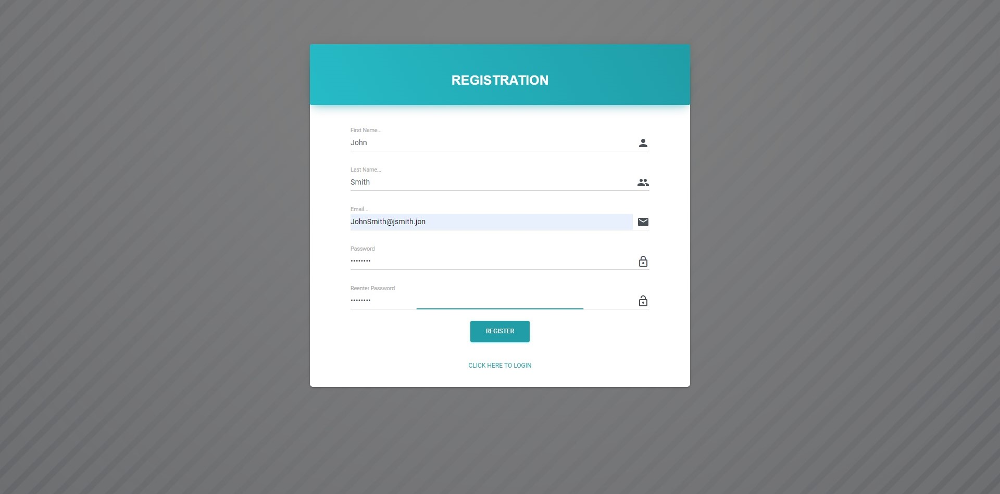
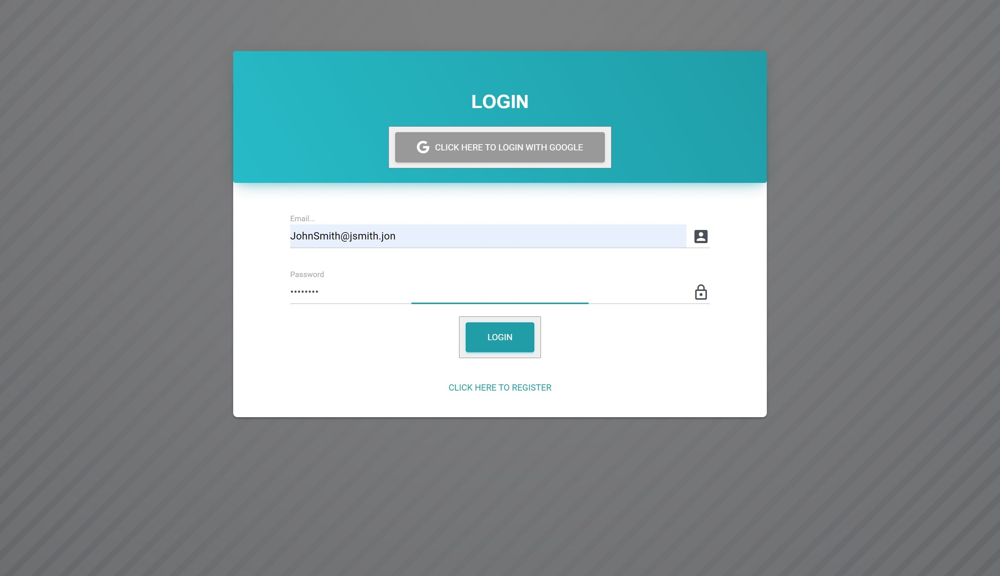
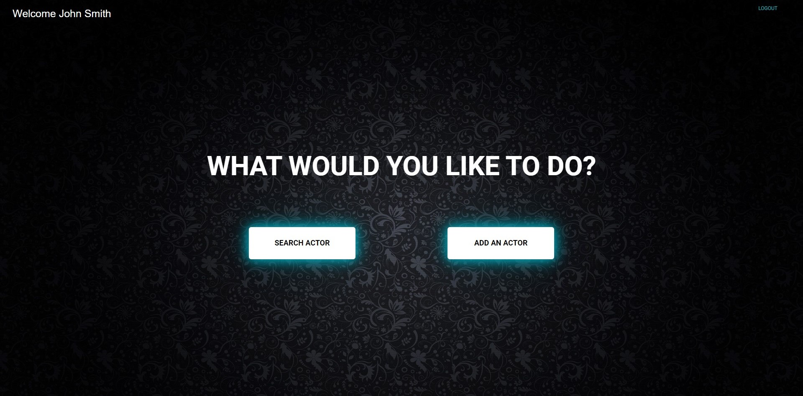
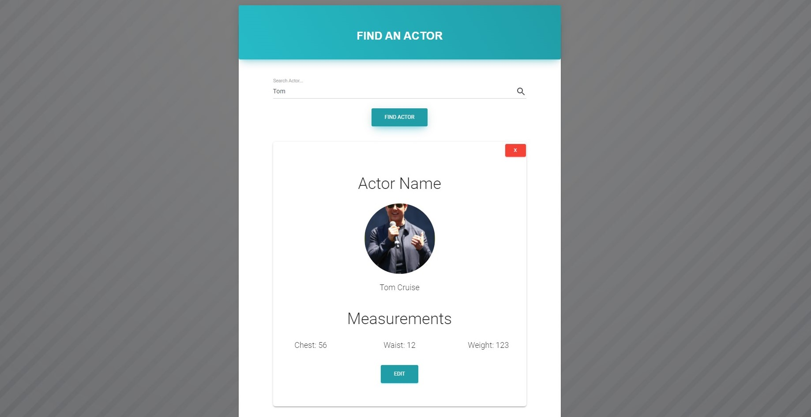

# Project 3

## **Table of Contents** 

  - [Description](#description)
  - [Elements](#elements)
  - [Technologies](#technologies)
  - [Installation Instructions](#installation)
  - [Usage](#usage)
  - [Contributors](#contributors)
  - [Aids](#aids)
  - [Links](#links)

## **Description**
For this project we needed to create a React based app. It needed to use a database, allow for login and authentication, and use new technologies.
We decided to base our app around using GraphQL and Material UI, both new technologies. 

## **Elements**

This app includes 
* login page and a registration page that use Firebase as an authentication service.
* a home page that allows you to move to the search page and add page. The frontend/UI was done using Material UI
* An add page that allows you to add a new element to the database, based in GraphQL
* A search page that allows you to search for elements of the database, based in GraphQL
* An update page that allows you to update elements of the database, based in GraphQL

The connection is set up here for local use. Below in the commented out section is the JAWSDB connection.

## **Technologies**
* HTML
* CSS
* JavaScript
* React
* React-dom
* Axios
* Material UI
* GraphQL
* Firebase
* Apollo
* Fastify

## **Installation Instructions**
Install all the dependencies available by using npm install command in the main folder, the src folder, and the client folder.
* React
* React-dom
* Axios
* Material UI-core
* Material UI-icons
* GraphQL
* Firebase
* Firebase-auth
* Apollo
* Fastify

## **Usage**
The app can be used for costume designers to easily access a specific actor measurements when they are preparing for an upcoming movie, television show, theatre/dance performance, etc.

To show logout and login with Google Functionality.

## **Contributors**
This project was done by:

> Anjali Pant -- https://github.com/Anjali9293
> 
> Jessica Zonta -- https://github.com/jessicaz47
> 
> Leah O'Gorman -- https://github.com/leahogorman
> 
> Shaun Samoridny -- https://github.com/SSamoridny
> 
> Victor Scherman -- https://github.com/vicscherman

## **Aids**
research was done by searching material UI, react, GraphQL, Firebase, Apollo, and Firebase

> https://material-ui.com/
> 
> https://reactjs.org/
> 
> https://graphql.org/
> 
> https://firebase.google.com/
> 
> https://www.apollographql.com/
> 
> https://www.fastify.io/

For our design we worked off of Material Kit React

> https://demos.creative-tim.com/material-kit-react/?_ga=2.79837332.227330893.1606685697-1197406823.1606234448#/

additional research was done by searching w3schools and stackoverflow

> https://www.w3schools.com/
> 
> https://stackoverflow.com/

Additionally the project was done with aid from our instructors

> Fil -- https://github.com/c0dehot
> 
> Daniel Ceballos -- https://github.com/shibeknight

## **Links**

The Heroku live link is: 

The Github link is: https://github.com/jessicaz47/Project3
                

